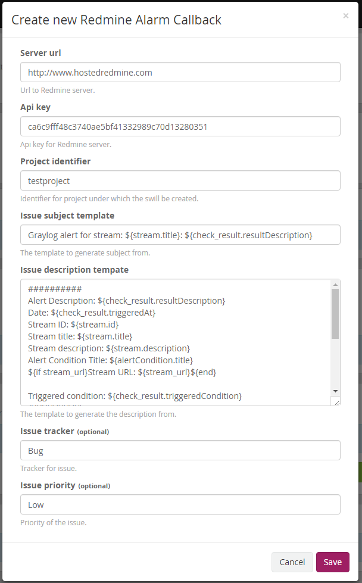

# Redmine Plugin for Graylog

Graylog alarm callback plugin for Redmine issue tracker.

**Required Graylog version:** 2.0 and later

Installation
------------

[Download the plugin](https://github.com/sidvi1/graylog-redmine-plugin/releases)
and place the `.jar` file in your Graylog plugin directory. The plugin directory
is the `plugins/` folder relative from your `graylog-server` directory by default
and can be configured in your `graylog.conf` file.

Restart `graylog-server` and you are done.

Usage
-----

